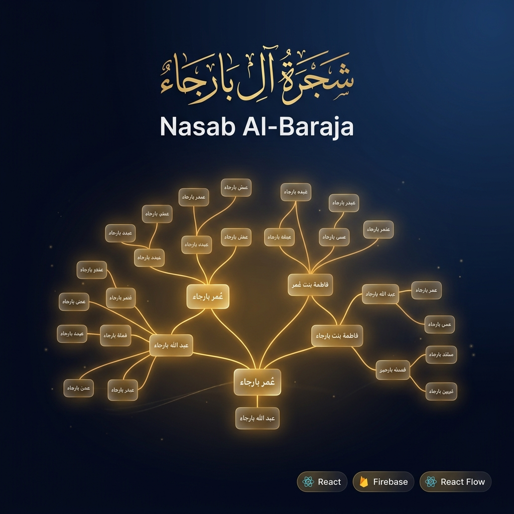

<p align="center">
  
</p>

<h1 align="center">Nasab Al-Baraja</h1>
<h3 align="center">شَجَرَةُ آلِ بَارَجَاء</h3>
<p align="center"><em>An interactive Arabic family tree built with React, Vite, and Supabase.</em></p>

<p align="center">
  <a href="https://opensource.org/licenses/MIT"></a>
  
  
  
  
  
</p>

---

## About

Nasab Al-Baraja is a multilingual family tree application for visualizing and maintaining the Al-Baraja lineage. It supports large trees, animated navigation, public suggestions, admin verification, and realtime synchronization through Supabase.

The project runs as a Vite web app and can also be packaged for Android through Capacitor.

---

## Features

- Interactive family graph with auto layout via React Flow and Dagre
- Full lineage search in Arabic, English, and Indonesian
- Public suggestion workflow for add-child and name-change proposals
- Admin approval flow with pending-node focus and verification queue
- Realtime notices and updates via Supabase subscriptions
- Theme switching, saved viewport, and mobile-friendly UI

---

## Tech Stack

```text
Frontend       React 18 + Vite 5
Graph          @xyflow/react + Dagre
Backend        Supabase (Postgres, Realtime, Auth)
Mobile         Capacitor Android
Styling        Vanilla CSS
Icons          Lucide React
```

---

## Getting Started

### Prerequisites

- Node.js 18+
- npm
- A Supabase project

### Installation

```bash
git clone https://github.com/dillahbaraja/nasab-al-baraja.git
cd nasab-al-baraja
npm install
```

### Environment Variables

Copy `.env.example` to `.env.local` and fill in your project values:

```bash
cp .env.example .env.local
```

```env
VITE_SUPABASE_URL="https://your-project.supabase.co"
VITE_SUPABASE_ANON_KEY="your_public_anon_key"
SUPABASE_URL="https://your-project.supabase.co"
SUPABASE_SERVICE_ROLE_KEY="your_service_role_key_for_server_side_scripts_only"
```

Notes:
- The frontend only needs `VITE_SUPABASE_URL` and `VITE_SUPABASE_ANON_KEY`.
- `SUPABASE_SERVICE_ROLE_KEY` is only for local/server-side scripts and must never be exposed to the browser.
- `SUPABASE_WEBHOOK_SECRET`, `SMTP_USER`, and `SMTP_PASS` are only for the Vercel serverless email webhook.

### Run Locally

```bash
npm run dev
```

### Production Build

```bash
npm run build
```

---

## Supabase Setup

Before using the public suggestion workflow, make sure your Supabase project is configured:

1. Enable `Anonymous sign-ins` in Supabase Auth.
2. Run [supabase_guest_policies.sql](./supabase_guest_policies.sql) in the Supabase SQL Editor.
3. Confirm the initial admin exists in `public.admin_users`.

To add another admin later:

```sql
insert into public.admin_users (email)
values ('adminbaru@example.com')
on conflict (email) do nothing;
```

To remove an admin:

```sql
delete from public.admin_users
where email = 'adminbaru@example.com';
```

---

## Deploy to Vercel

This project is ready for Vercel as a standard Vite app.

Set these Environment Variables in Vercel:

- `VITE_SUPABASE_URL`
- `VITE_SUPABASE_ANON_KEY`
- `SUPABASE_URL`
- `SUPABASE_SERVICE_ROLE_KEY`
- `SUPABASE_WEBHOOK_SECRET`
- `SMTP_HOST`
- `SMTP_PORT`
- `SMTP_USER`
- `SMTP_PASS`
- `EMAIL_FROM`

Recommended build settings:

```text
Framework Preset: Vite
Build Command: npm run build
Output Directory: dist
```

After deploy, make sure your Supabase project already has:
- the `nodes` and `notices` tables
- the `admin_users` table
- the policies from `supabase_guest_policies.sql`

### Email Notifications

The repository now includes a Vercel serverless webhook endpoint at `api/email/supabase-event.js` for sending email notifications through SMTP.

Supported notifications:

- New member registration with `claim_status = 'pending'` -> sent to all admins
- New admin promotion with `member_level = 'admin'` and `claim_status = 'approved'` -> sent to all verified members and admins
- New guest proposal in `notices.type in ('proposal_add_child', 'proposal_name_change')` -> sent to all admins

#### Gmail SMTP Setup

1. Enable `2-Step Verification` on `info.albaraja@gmail.com`.
2. Generate an `App Password` from Google Account security settings.
3. Store the password in Vercel as `SMTP_PASS`.
4. Use these Vercel environment values:

```env
SUPABASE_URL="https://your-project.supabase.co"
SUPABASE_SERVICE_ROLE_KEY="your_service_role_key"
SUPABASE_WEBHOOK_SECRET="your_shared_webhook_secret"
SMTP_HOST="smtp.gmail.com"
SMTP_PORT="465"
SMTP_USER="info.albaraja@gmail.com"
SMTP_PASS="your_gmail_app_password"
EMAIL_FROM="Nasab Al-Baraja <info.albaraja@gmail.com>"
```

#### Supabase Webhook Setup

Create two Database Webhooks in Supabase and point both of them to your Vercel deployment URL:

```text
https://your-vercel-domain.vercel.app/api/email/supabase-event
```

Use `Authorization: Bearer <SUPABASE_WEBHOOK_SECRET>` as a custom header.

Webhook 1:

- Table: `public.baraja_member`
- Events: `Insert`, `Update`

Webhook 2:

- Table: `public.notices`
- Events: `Insert`

The endpoint filters the events internally, so only these cases will send email:

- `baraja_member.claim_status` changed to `pending`
- `baraja_member.member_level` changed to `admin` while `claim_status = 'approved'`
- `notices.type` is `proposal_add_child` or `proposal_name_change`

The webhook handler also writes a unique event key into `public.email_webhook_log` before sending, so repeated webhook retries do not send duplicate emails.

#### Email Content

- Subject: Arabic + English
- Body: Arabic + English + Indonesian
- Member and admin notices show both `arabic_name_snapshot` and `english_name_snapshot`
- Proposal notices include target name and parent name when available

---

## Project Structure

```text
nasab-al-baraja/
├── src/
│   ├── FamilyGraph.jsx
│   ├── FamilyNode.jsx
│   ├── NodeEditModal.jsx
│   ├── layout.js
│   ├── i18n.js
│   ├── supabase.js
│   └── index.css
├── public/
│   └── assets/
├── android/
├── .env.example
├── supabase_guest_policies.sql
└── task.md
```

---

## Android

```bash
npm run build
npx cap sync
npx cap open android
```

---

## Notes

- The app expects the `nodes` table to contain numeric `id` values.
- Public suggestions are stored as pending data and remain visible until verified by an admin.
- Admin access is determined from `public.admin_users`, not simply from “logged in” status.

---

## Author

**Abdillah Baradja**  
Email: [dillahbaraja@gmail.com](mailto:dillahbaraja@gmail.com)

---

## License

This project is licensed under the MIT License. See [LICENSE](LICENSE).
