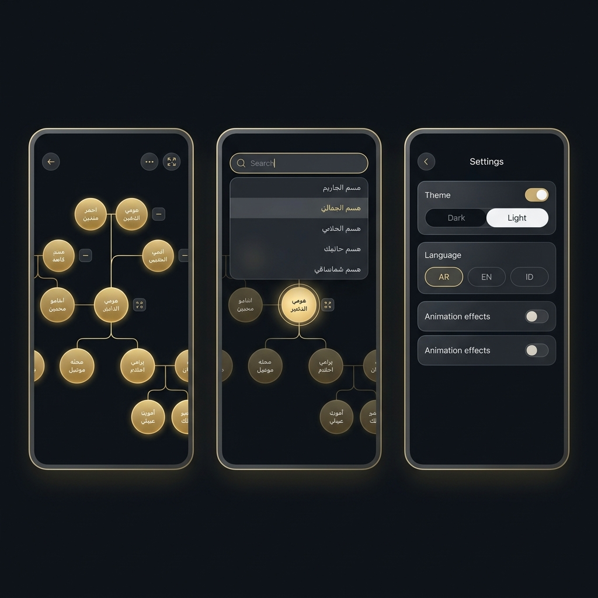

<p align="center">
  
</p>

<h1 align="center">🌳 Nasab Al-Baraja</h1>
<h3 align="center">شَجَرَةُ آلِ بَارَجَاء</h3>
<p align="center"><em>An interactive, real-time Arabic family tree visualization app</em></p>

<p align="center">
  <a href="https://opensource.org/licenses/MIT"></a>
  
  
  
  
  
</p>

---

## 📖 About

**Nasab Al-Baraja** is a modern, interactive family tree application built to visualize and preserve the genealogy of the Al-Baraja family. It renders lineage as a live, navigable graph — supporting thousands of nodes with smooth camera animations, collapsible branches, and real-time cloud sync.

The app is fully bilingual-ready (Arabic, English, Indonesian) with RTL text support, and is available as both a **Progressive Web App** and a native **Android application** via Capacitor.

---

## ✨ Features

<p align="center">
  
</p>

| Feature | Description |
|---|---|
| 🗺️ **Interactive Graph** | Auto-layouted family tree powered by React Flow + Dagre with top-down hierarchy |
| 🎥 **Arc Camera Animation** | Google Maps-like 3-phase zoom navigation between nodes (zoom out → pan → zoom in) |
| 🔍 **Smart Search** | Full-lineage search (child → father → grandfather) with Arabic & Latin support and autocomplete |
| 🌿 **Collapse / Expand** | Click to collapse subtrees with smooth grouping animation; recursive expand-all button |
| 👤 **Person Detail Popup** | Long-press any node to view full profile with lineage description and children list |
| 🎨 **Dynamic Themes** | Light, Dark, and Warm themes with glassmorphism styling |
| 🌍 **Multilingual** | Full UI translation for العربية (AR), English (EN), Bahasa Indonesia (ID) |
| ☁️ **Real-time Sync** | Live data updates via Firebase Firestore — changes appear instantly on all devices |
| 🔔 **Notifications** | Real-time toast alerts for newly added family members |
| 📍 **Persistent Viewport** | Camera position and zoom level saved between sessions |
| 📱 **Android Native** | Packaged as an Android app via Capacitor with status bar integration |
| ⚡ **Optimized Performance** | Memoized `personMap` (O(1) lookups), pre-built `searchIndex`, stable callbacks |

---

## 🛠️ Tech Stack

```
Frontend         React 18 + Vite 5
Graph Engine     @xyflow/react (React Flow) v12
Auto-layout      Dagre
Database         Firebase Firestore (real-time)
Auth             Firebase Authentication
Icons            Lucide React
Mobile           Capacitor (Android)
Styling          Vanilla CSS (custom theme tokens)
```

---

## 🚀 Getting Started

### Prerequisites

- [Node.js](https://nodejs.org/) v18+
- [npm](https://www.npmjs.com/)
- A Firebase project with Firestore enabled

### Installation

**1. Clone the repository**
```bash
git clone https://github.com/dillahbaraja/nasab-al-baraja.git
cd nasab-al-baraja
```

**2. Install dependencies**
```bash
npm install
```

**3. Configure environment**

Copy the example env file and fill in your Firebase credentials:
```bash
cp .env.example .env.local
```

```env
VITE_FIREBASE_API_KEY=your_api_key
VITE_FIREBASE_AUTH_DOMAIN=your_project.firebaseapp.com
VITE_FIREBASE_PROJECT_ID=your_project_id
VITE_FIREBASE_STORAGE_BUCKET=your_project.appspot.com
VITE_FIREBASE_MESSAGING_SENDER_ID=your_sender_id
VITE_FIREBASE_APP_ID=your_app_id
```

**4. Run development server**
```bash
npm run dev
```

**5. Build for production**
```bash
npm run build
```

---

## 📱 Android Build

Make sure [Android Studio](https://developer.android.com/studio) is installed, then:

```bash
npm run build
npx cap sync
npx cap open android
```

Build the APK from Android Studio or run directly on a connected device.

---

## 🗂️ Project Structure

```
nasab-al-baraja/
├── src/
│   ├── FamilyGraph.jsx     # Main app component (graph, search, navigation, settings)
│   ├── layout.js           # Dagre auto-layout engine (immutable node positioning)
│   ├── translations.js     # i18n strings (AR / EN / ID)
│   ├── firebase.js         # Firebase initialization
│   └── index.css           # Global styles & theme variables
├── public/
│   └── assets/             # Static images and icons
├── android/                # Capacitor Android project
├── .env.example            # Environment variable template
└── firebase.json           # Firebase hosting & Firestore rules
```

---

## ⚡ Performance

The app is optimized for large family datasets:

- **`personMap` useMemo** — O(1) person lookups instead of O(N) `Array.find()` on every access
- **`searchIndex` useMemo** — Pre-built search index per data load; searches run in O(N) instead of O(N × depth)
- **Stable callbacks** — `onLongPress`, `t()` wrapped in `useCallback` to prevent unnecessary child re-renders
- **Immutable layout** — Node positions computed via `Array.map()` (no direct object mutation)
- **Single Firestore subscription** — Listeners use stable `[]` deps (not `[db]`) to prevent re-subscriptions

---

## 🌐 Firestore Data Structure

```
/family/{docId}
  ├── id           : number        — Unique person ID
  ├── arabicName   : string        — Full Arabic name
  ├── englishName  : string        — Romanized name
  ├── fatherId     : number|null   — Parent reference (null = root)
  └── info         : string        — Additional biographical notes

/notices/{docId}
  ├── title        : string
  ├── message      : string
  └── timestamp    : number        — Unix timestamp (ms)
```

---

## 👤 Author

**Abdillah Baradja** — *Core Developer*
📧 [dillahbaraja@gmail.com](mailto:dillahbaraja@gmail.com)

---

## 📄 License

This project is licensed under the **MIT License** — see the [LICENSE](LICENSE) file for details.

---

<p align="center">
  Made with ❤️ for the Al-Baraja family lineage
  <br/>
  <sub>بُنِيَ بِمَحَبَّةٍ لِحِفْظِ نَسَبِ آلِ بَارَجَاء</sub>
</p>
